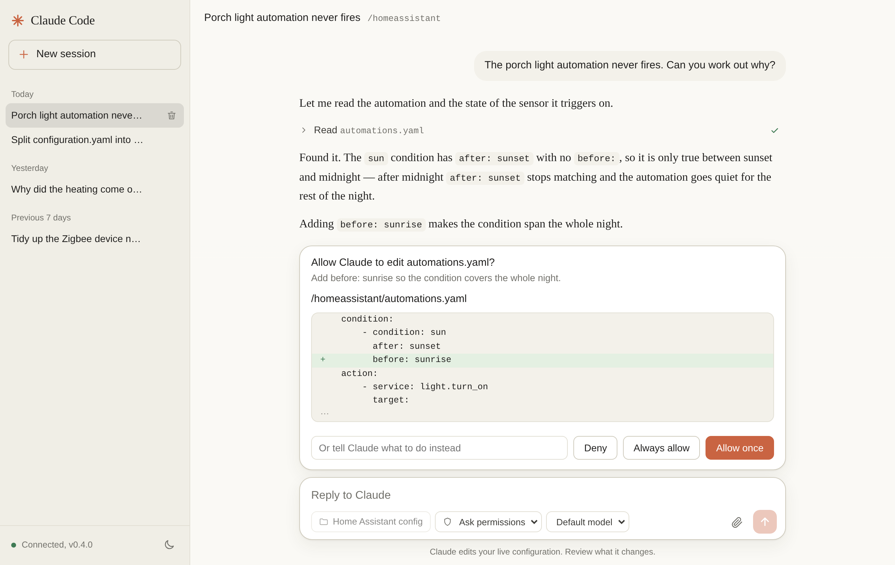

# Claude Code for Home Assistant

A Home Assistant add-on (**Apps**, in recent releases) that runs
[Claude Code](https://claude.com/claude-code) on your Home Assistant machine and
gives it a Claude Desktop-style panel in the sidebar. Claude works directly in
your configuration folder — `configuration.yaml`, automations, scripts,
packages — and can validate the configuration and restart Core through the
Supervisor API. It asks before it edits or runs anything.

<picture>
  <source media="(prefers-color-scheme: dark)" srcset="docs/panel-dark.png">
  
</picture>

- **A chat panel in the sidebar**, served over ingress: admin-only, and no port
  to expose.
- **Approvals before anything changes.** Per-action prompts, *Always allow*
  rules, or Plan mode, where Claude only reads and then shows you a plan.
- **Sessions are saved** and survive an add-on restart. Idle ones close to free
  memory and resume on your next message; delete the ones you are done with.
- **Your folders, and no others**: `/homeassistant`, `/config` and `/share`.
  `secrets.yaml` and the auth store can be kept out of reach.
- **Home Assistant context.** Claude's shell gets an `ha-api` helper for the
  Core REST API and the Supervisor endpoints: states, services, config check,
  restart.
- **Prebuilt images** for `aarch64` and `amd64`, so installing does not compile
  anything on the device.

## Requirements

- Home Assistant OS or Supervised. Add-ons need the Supervisor, so Home
  Assistant Container and Core installations cannot run this.
- `aarch64` or `amd64`. Each running session is its own Claude Code process at
  roughly 300 to 500 MB, so on a 4 GB Raspberry Pi 5 keep two or three.
- A Claude subscription (Pro, Max, Team or Enterprise) or an Anthropic API key.

## Install

1. Settings > Apps > App store > menu > **Repositories**, and add
   `https://github.com/pierrejochem/ha-claude-code`.
2. "Claude Code" appears in the store. **Install** — this downloads a ready-built
   image instead of compiling the add-on on the device.
3. Configuration tab: paste a token from `claude setup-token` or an API key.
4. Start, then open **Claude Code** in the sidebar.

[DOCS.md](claude_code/DOCS.md) is the add-on's documentation: signing in, the permission
modes, what Claude can reach, sessions from elsewhere, every option, and
troubleshooting. [CHANGELOG](claude_code/CHANGELOG.md) has what changed per
version.

## Repository layout

```
claude_code/
  config.yaml          app manifest: ingress panel, folder mappings, options
  Dockerfile           Alpine base + Node + the packages Claude Code needs on musl
  run.sh               sets HOME=/data/home so sessions and rules persist
  app/
    src/server.ts        HTTP + WebSocket server, ingress-only
    src/live-session.ts  one Agent SDK query() per running session
    src/prompt.ts        Home Assistant context appended to the system prompt
    bin/ha-api            curl wrapper for the Core and Supervisor APIs
    public/               the panel (built from src/web with esbuild)
```

## Run your own changes on Home Assistant

1. Copy the `claude_code` folder to `/addons/claude_code` on the Home Assistant
   machine (Samba share `addons`, or the SSH app).
2. Delete the `image:` line from `/addons/claude_code/config.yaml`. While that line
   is there the Supervisor pulls the published image instead of building your copy.
   It is tracked in git, so **re-copying the folder brings it back** — delete it
   again every time you re-sync, or the add-on silently reverts to the released
   version with no version change to warn you.
3. Settings > Apps > App store > menu > **Check for updates**. "Claude Code"
   appears under **Local apps**.
4. Install. The image is built on the device; on a Raspberry Pi 5 expect a few
   minutes, most of it downloading the Claude Code binary (about 200 MB).
5. For a later edit: re-copy the folder, delete the `image:` line again, then use
   **Rebuild** on the add-on's Info tab.

## Work on the panel without Home Assistant

```
cd claude_code/app
npm install
npm run dev        # builds, then http://localhost:8099, working folder = current directory
```

Dev mode skips the ingress IP check and uses whatever Claude Code login the
machine already has.

## How it fits together

The browser holds one WebSocket to the add-on. Every running session is an
Agent SDK `query()` in streaming-input mode: user messages are pushed into an
async queue, SDK messages are logged with a sequence number and broadcast, and
token deltas are broadcast without being logged. A reconnecting browser sends
the last sequence number it saw and gets the rest, which matters on phones
where ingress sockets drop often. Permission prompts are the SDK's
`canUseTool` callback held open until the panel answers.

## Releasing

[RELEASING.md](RELEASING.md). The short version: the Supervisor pulls the image
tag matching `version` in `claude_code/config.yaml`, so the tag is pushed and
published before the bump reaches `main`.
